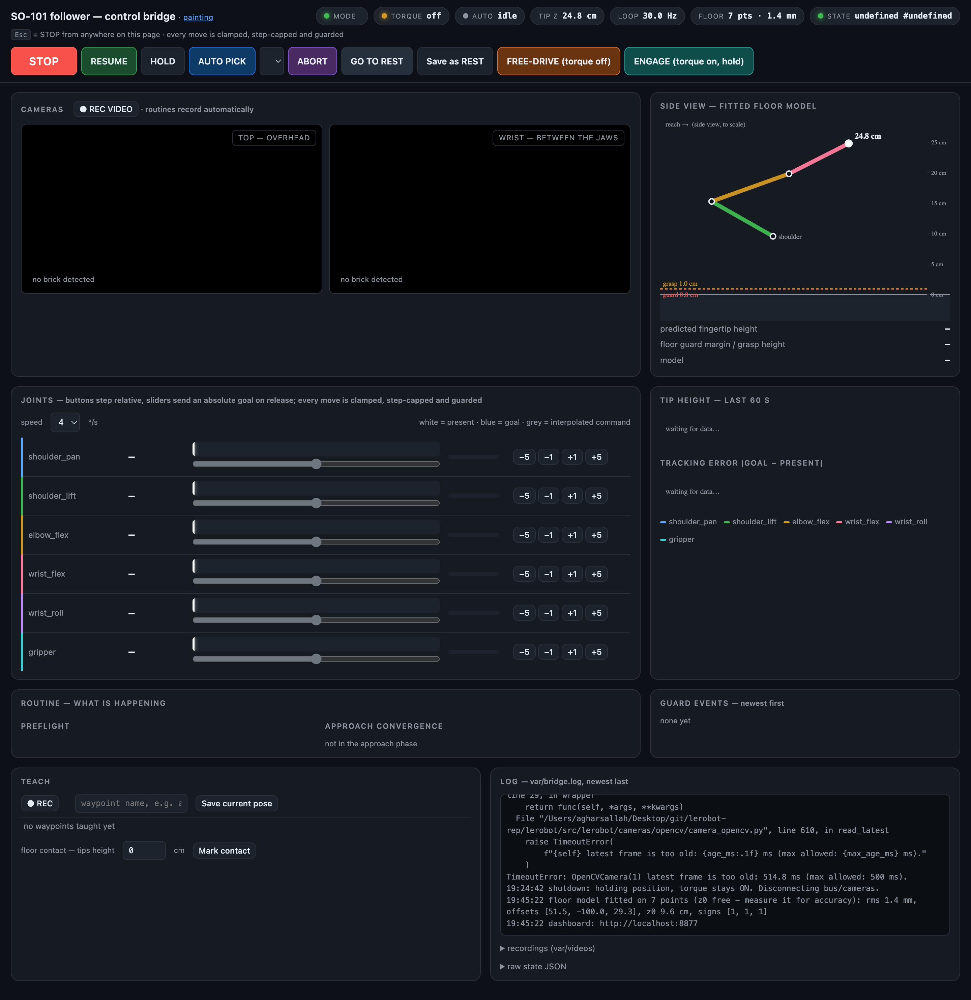
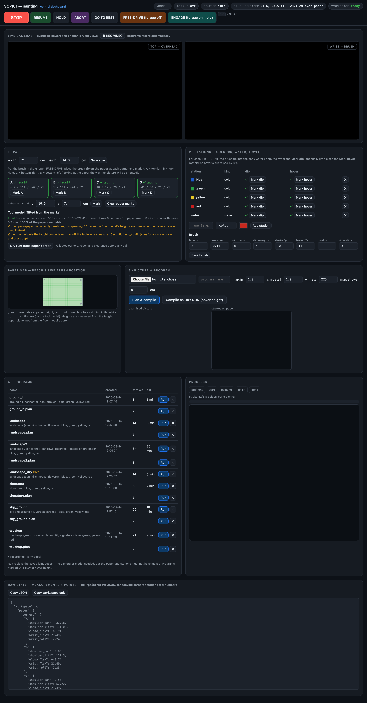

# SO-101 control bridge

A Python daemon that owns an SO-101 follower arm and its two cameras. Everything else — an operator at
the dashboard, an AI agent writing JSON files, the built-in autonomous pick-and-place — sends *goals*
to it. The daemon enforces every safety rule itself, so a bad command becomes a slow, limited or
refused move, never a jerk and never a push into the table.

```bash
uv sync                 # install (lerobot comes from ../lerobot)
uv run so101-bridge     # start the daemon; dashboard on http://localhost:8765
```

Stop the arm at any time: the dashboard **STOP** button, `scripts/STOP.command` (double-click in
Finder), or `touch ESTOP` in any terminal. Clear it with **RESUME** or `scripts/RESUME.command`.

**Read [`docs/operations.md`](docs/operations.md) before touching the arm** — it is the operator and
agent manual: startup, the command interface, the state format, what every log line means, and what
to do when something goes wrong.

## Screenshots

| Control dashboard (`/`) | Painting page (`/paint`) |
| --- | --- |
| [](docs/img/dashboard.png) | [](docs/img/paint.png) |

Status chips, camera streams, to-scale floor-model side view, per-joint tracks/load/charts, routine and
guard-event panels, log tail (left); paper/station teaching, tool-model fit, reachability map, picture →
program compiler and saved programs (right). Rendered with mock state, no arm attached — real values fill
in once the daemon is running.

## Documentation

| File | What it covers |
| --- | --- |
| [`docs/operations.md`](docs/operations.md) | **the manual.** Start/stop, safety rules the daemon enforces, dashboard panels, standard procedures (auto pick, rest, jogging, teaching), the full command/state/log interface, joint-geometry cheat sheet, failure → remedy table, file layout |
| [`docs/learnings.md`](docs/learnings.md) | why things are the way they are: hardware/firmware quirks, joint conventions, the floor model, vision tuning — the reasoning behind the rules in `operations.md` |
| [`docs/metadata.json`](docs/metadata.json) | every calibrated number, machine-readable: motor IDs/gains, camera indices, joint limits and conventions, guard thresholds, floor-model fit, vision gates, known poses, painting tuning |
| [`docs/decision-log.json`](docs/decision-log.json) | chronological log of tuning decisions and why each was made |
| [`docs/motion-log-pick-place.md`](docs/motion-log-pick-place.md) | run-by-run log of pick-and-place attempts |

## Helpers

| Command | Effect |
| --- | --- |
| `make run` (`uv run so101-bridge`) | start the daemon; dashboard on http://localhost:8765 |
| `make test` (`uv run pytest -q`) | unit tests, no hardware needed |
| `make lint` / `make fmt` | `ruff check` / `ruff check --fix` |
| `make stop` (`touch ESTOP`) | freeze the arm right now, from any terminal |
| `make resume` (`rm -f ESTOP`) | clear the emergency stop |
| `make clean` | drop `var/` runtime artifacts (keeps `config/`) |
| `scripts/STOP.command` / `RESUME.command` / `RELEASE.command` | double-click in Finder: STOP, RESUME, torque off |
| `scripts/paint.sh <plan> [from_stroke]` | compile `paintings/<plan>.plan.json` and run it without a browser or agent; `DRY=1` runs the same moves at hover height (see `docs/operations.md` §11) |

Emergency stop is always a `touch ESTOP` away at the repository root, and always cleared with `make resume` or the
dashboard **RESUME** button — restarting the bridge never drops torque, the arm holds its pose through a restart.

## Layout

| Path | What it holds |
| --- | --- |
| `src/so101_bridge/` | the package (see below) |
| `config/` | what you may edit: `limits.json`, `rest.json`, `floor_points.json`, `waypoints.json`, and optional overlays `settings.json` (any constant in `settings.py`, see `settings.example.json`) and `poses.json` (taught paths, see `poses.example.json`) |
| `var/` | runtime only, never committed: `bridge.log`, `state.json`, `cmd/`, `done/`, `recordings/`, camera snapshots |
| `scripts/` | double-clickable `STOP` / `RESUME` / `RELEASE` for the operator |
| `docs/` | operations manual, learnings, machine-readable `metadata.json`, decision log |
| `paintings/` | compiled painting programs (`<name>.json`): joint poses for every step, replayable without model or cameras |
| `tests/` | unit tests for the parts that need no hardware |
| `ESTOP` | presence of this file freezes the arm; kept at the root so it is one short `touch` away |

## Modules

| Module | Responsibility |
| --- | --- |
| `app.py` | entry point and the 30 Hz control loop — the only code that talks to the motor bus |
| `hardware.py` | connect, motor gains, soft-limit derivation |
| `controller.py` | shared state, command queue, recording, waypoints, motion helpers |
| `routines.py` | registry of named routines; a routine is `run(ctrl)` that only requests goals and reports `ctrl.phase(...)` |
| `autopick.py` | the built-in `pick_place` routine (registered via `@routine`) |
| `paint/` | painting: taught workspace (`workspace.py`), brush-tip kinematics on the paper plane (`kinematics.py`), picture → hatch strokes (`planner.py`), strokes → replayable joint program (`program.py`), the `paint` routine (`routine.py`) |
| `floor.py` | fitted floor model: predicted fingertip height, the guard that protects the table |
| `vision.py` | brick detection and the dashboard overlay |
| `dashboard.py` + `web/dashboard.html` | local HTTP dashboard (status chips, camera streams, to-scale side view of the floor model, joint tracks with load, tip-height and tracking-error charts, log tail) and the JSON/MJPEG interfaces |
| `settings.py` | hardware identity and tuning constants (defaults); override per deployment in `config/settings.json` or `$SO101_SETTINGS` |
| `paths.py` | where config and runtime files live |
| `poses.py`, `util.py` | proven joint poses; logging and atomic writes |

## Dashboard overview

Header chips (mode, torque, routine, predicted tip height, loop rate, floor model, state age) and the
control bar; <kbd>Esc</kbd> triggers STOP from anywhere on the page. Panels: camera streams with the
detection overlay; to-scale side view of the arm as the floor model sees it; joint tracks (present /
goal / command, load vs guard limit, jog buttons and sliders); tip-height and tracking-error charts;
**Routine** (phase tracker with timings, preflight checklist, approach-convergence gauges);
**Guard events** (what the safety layer did, newest first); Teach (REC, waypoints, floor contacts); log tail.

`/state` carries everything the page shows — `progress`, `events`, `preflight`, `routines` — so an
agent can follow a run without the page. Start a routine with `/cmd?a=routine&name=pick_place` or a
`{"action": "routine", "name": "pick_place"}` command file.

## Painting (http://localhost:8765/paint)

1. **Paper** — enter the paper size; with the brush in the gripper, FREE-DRIVE the brush tip onto each corner
   (A top-left, B top-right, C bottom-right, D bottom-left) and mark it. The tool model is fitted from these
   marks: brush pitch and length, and the arm→paper mapping; the page shows the fit residuals and a
   reachability map of the paper. *Dry run: trace paper border* moves along the border at hover height.
2. **Stations** — add colour pans (with their colour), the water cup and a towel; mark the dip pose for each
   (and optionally a hover pose).
3. **Picture → program** — upload a picture; it is quantised to the taught colours, hatched with strokes at the
   brush width, and compiled to a program of guarded `path` steps (dips, rinses, strokes) saved in `paintings/`.
   *Compile as DRY RUN* keeps every stroke at hover height.
4. **Programs** — Run replays the saved joint poses (no camera or model needed; paper and stations must not
   have moved). Progress shows the phase, current colour/stroke and the strokes painted so far.

Requires the floor model (the tool model builds on its fitted chain). Poses in a program are precomputed,
so a picture painted once can be painted again later from the saved file.

## Development

```bash
uv run pytest        # unit tests (no hardware needed)
uv run ruff check .  # lint
```

Safety rules live in the control loop (`app.control_loop`) and in `Controller`; the routines can only
*request* goals, never bypass a guard. Keep it that way when adding behaviour.
